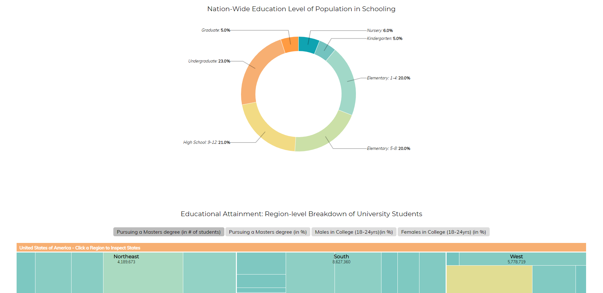

## Τίτλος εργασίας: Εργασία Ανάπτυξης: Οπτικοποίηση δεδομένων εκπαιδευτικού συστήματος (USA)
### Ονοματεπώνυμο: Βαγγέλης Παπαδημητρίου
### Αριθμός Μητρώου: Π2017146

Η παρακάτω αναφορά αποτελεί την τελική αναφορά για την εργασία ανάπτυξης Οπτικοποίησης Δεδομένων στο μάθημα της Επικοινωνίας ανθρώπου-υπολογιστή. Περιέχει αναλυτική περιγραφή των εργαλείων,των μεθόδων και της τεχνικής ανάπτυξης των δύο παραδοτέων. Ακόμη, περιέχει εικόνες της δουλειάς που έγινε. Παραθέτονται επείσης τα συμπεράσματα της εργασίας, η βιβλιογραφία και οι σύνδεσμοι οι οποίοι χρησιμοποιήθηκαν για την κατανόηση και την ανάπτυξη των παραδοτέων.

#### [Εκτλεσιμο λινκ](https://p17papa4.github.io/D3js-US-educational-attainment/)
#### [Προφιλ στο github](https://github.com/p17papa4)
#### [Λινκ αποθετηρίου εργασίας](https://github.com/p17papa4/D3js-US-educational-attainment)
#### [Λινκ αποθετηρίου τελικής αναφοράς](https://github.com/p17papa4/hci-Report)

## Εισαγωγή
Υλοποίησα όλα τα ζητούμενα του πρώτου παραδοτέου, καθώς και το πρώτο ζητούμενο του δεύτερου παραδοτέου. Τα προβλήματα που αντιμετώπισα είναι ότι δεν κατάφερα να κάνω responsive όλα τα γραφήματα και δεν άλλαξα τα γραφήματα με άλλα στο 2ο παραδοτέο,ούτε πρόσθεσα 3 δικά μου. Τα υπόλοιπα ζητούμενα υλοποιήθηκαν χωρίς ιδιαίτερα προβλήματα.

## Aνάλυση σχετικών έργων και εργαλείων
Για το 2ο παραδοτέο, έγινε χρήση του codepen για την εύρεση και την κατανόηση των d3.js γραφημάτων. Ακόμη, στο πρώτο παραδοτέο χρησιμοποιήθηκε η βιβλιοθήκη responsivevoice η οποία βοήθησε στο text to speech.

Αναλυτικές αλλαγές :

Η μέθοδοι για την υλοποίηση των 2 παραδοτέων της εργασίας ανάπτυξης ήταν οι εξής:
* Αναζήτηση στον ιστό σχετικά με html,javascript και συγκεκριμένα Jquery,css, εκμάθηση των βασικών στοιχείων κάθε γλώσσας και της χρήσης τους.

* Πιο αναλυτικά, στην αλλαγή των χρωμάτων έψαξα τα αντίστοιχα αρχεία js του κάθε γραφήματος για τις τιμές των χρωμάτων, και μετά απο την αλλαγή του καθενός λύθηκε το αρχικό πρόβλημα.

* Για τις διεπαφές, στο css αρχείο άλλαξα το layout, τα χρώματα και την πυκνότητα των περιγραμμάτων όλων των κουμπιών που αντιστοιχούσαν στα γραφήματα

* Μετά απο αναζήτηση στο google έμαθα πως να βάζω ήχο στο mouseover του κάθε κουμπιού περιήγησης. 

* Για το text-to-speech χρησιμοποίησα το responsive voice τοποθετώντας το σε κάθε tag για τα κείμενα της σελίδας στο index html αρχείο μέσω της js. 

* Για το responsive design χρησιμοποίησα ένα dropdown menu όταν η οθόνη προβολής δεν ήταν επαρκής (αλλαγές στο html και css αρχείο).

* Για την εμφάνιση-απόκρυψη του κάθε γραφήματος έγινε χρήση μιας συνάρτησης javascript η οποία εντάχθηκε στο html αρχείο.

## Aποτελέσματα με λεζάντες σε ενδεικτικές εικόνες
### 1ο Παραδοτέο
- [x] Αλλάξτε τα χρώματα στα 3 γραφήματα. 

Αρχικό : 

Αλλαγή : 

- [x] Αντικαταστήστε τις διεπαφές στα "κουμπιά" του 2ου και 3ου γραφήματος με άλλες της επιλογής σας. 

Αρχικό : 

Αλλαγή : 

- [x] Όταν το ποντίκι διέρχεται επάνω από κάθε επιλογή του menu στην κορυφή της σελίδας, να ακούγεται κάποιος ήχος της επιλογής σας. 
- [x] Όταν το ποντίκι διέρχεται πάνω από κάποια πρόταση/κείμενο της σελίδας ή περιοχή που περιλαμβάνει γραπτή πληροφορία (π.χ. κάποιο τμήμα γραφήματος), να ακούγεται αυτόματα η αφήγηση του κειμένου (text-to-speech). 
- [x] Εφαρμόστε responsive design στη σελίδα και κυρίως στο αρχικό menu έτσι ώστε να προσαρμόζεται σε οθόνες διαφορετικών διαστάσεων (π.χ. Bootstrap).

### 2ο Παραδοτέο
- [x] Τροποποιήστε τον κώδικα και το μενού της εφαρμογής έτσι ώστε κάθε στιγμή να είναι εμφανές μόνο ένα από τα 3 γραφήματα, παραμένοντας πάντα στη σελίδα index.html. 
- [ ] Αντικαταστήστε το κάθε ένα από τα 3 γραφήματα με κάποιο άλλο διαδραστικό γράφημα της D3js. (Δέν έγινε)
- [ ] Σε μια καινούργια σελίδα, να τοποθετήσετε αντίστοιχα 3 νέα διαδραστικά γραφήματα D3js της επιλογής σας, τα οποία θα οπτικοποιούν καινούργια στατιστικά δεδομένα που θα βρείτε από κάποια επίσημη στατιστική αρχή (π.χ. ΕΛΣΤΑΤ, Eurostat κ.λπ.).

Τα συμπεράσματα μου από την εργασία είναι ότι η html,javascript και css είναι πολύ ενδιαφέρουσες γλώσσες προγραμματισμού και ήταν ευχάριστη η ενασχόληση με αυτές. Η χρήση του GitHub για την ολοκλήρωση της εργασίας διεύρυνε τις γνώσεις μου για τις δυνατότητες και την χρήση του. Επίσης τα d3 γραφήματα χρησιμοποιούνται ευραίως. Συνεπώς, η εργασία ήταν ενδιαφέρουσα και με έκανε να βελτιώσω τις γνώσεις μου για την επίτευξή της. Λόγω έλλειψης χρόνου δεν υλοποίησα το 2ο και 3ο ζητούμενο του 2ου παραδοτέου.

## Βιβλιογραφία και σύνδεσμοι σε σχετικές εργασίες

Χρησιμοποιώντας το google ως κύρια μέθοδο πληροφόρησης η βιβλιογραφία-links τα οποία βοήθησαν είναι τα παρακάτω:

* [responsive voice](https://responsivevoice.org/)
* [stack overflow](https://stackoverflow.com/)
* [d3 github](https://github.com/d3/d3/wiki/Gallery)

* Η εργασία βασίστηκε στον κώδικα της [αρχικής εργασίας](https://github.com/ioniodi/D3js-US-educational-attainment).
